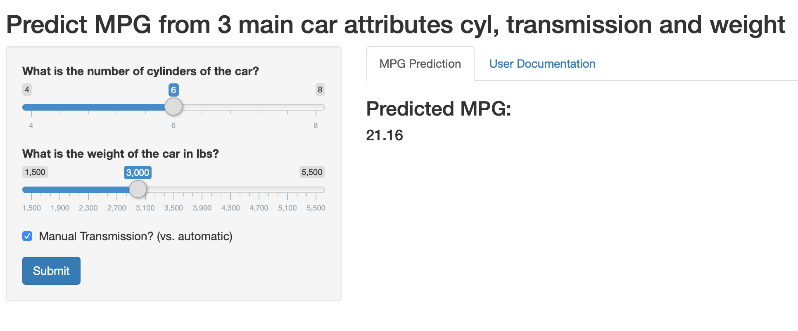

```{r setup, include=FALSE}
knitr::opts_chunk$set(echo = TRUE)
```

## Introduction

The shiny app "Predict MPG" is a shiny app to predict a car's usage of US gallons of gas per mile *(miles per gallon or MPG)* based on the number of cylinders, the weight in lbs and the type of transmission. 

Previous data analysis showed that these predictors have a major influence on the MPG usage.


## Data Set

For the prediction I useed the mtcars dataset. A data frame with 32 observations on 11 (numeric) variables. 
<font size=4>

* [, 1]	mpg	Miles/(US) gallon 
* [, 2]	cyl	Number of cylinders 
* [, 3]	disp	Displacement (cu.in.) 
* [, 4]	hp	Gross horsepower 
* [, 5]	drat	Rear axle ratio 
* [, 6]	wt	Weight (1000 lbs) 
* [, 7]	qsec	1/4 mile time 
* [, 8]	vs	Engine (0 = V-shaped, 1 = straight) 
* [, 9]	am	Transmission (0 = automatic, 1 = manual) 
* [,10]	gear	Number of forward gears 
* [,11]	carb	Number of carburetors 

</font>

## Prediction Model
For the prediction I use a linear regression model with the outcome *mpg* and the predictores *am, cyl and wt*

```{r mtcars}
modelMPG <- lm(mpg ~ factor(am)+ cyl + wt, data=mtcars)
```

Example prediction for manual transmission, 4 cylinders and 2500 lbs weight:
```{r}
predict(modelMPG, newdata=data.frame(cyl=4, wt=2.5, am=1))
```


## App on shinyapps.io



URL: <https://uldi8400.shinyapps.io/mpgprediction/>
